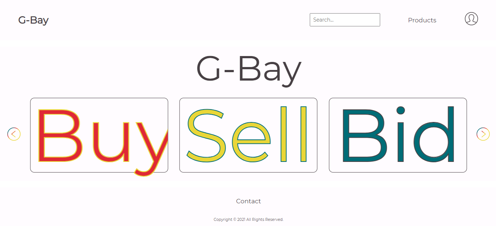

<h1 align="center" style="font-weight: 700">
<font size="10">G-Bay</font>
</h1>

##

<div align="center">

</div>

<p align="center">
This project is part of the <a href="https://becode.org/">Becode</a> training
</p>

## **Contents**
- [Description](#description)
- [How to Install and Run the Project](#configuration_guide)
  - [API](api/README.md)
  - [Client Side](client/README.md)
- [Features](#features)
- [Development Book](DEVBOOK.md)
- [Contributors](#contributors)

## **Description**
G-Bay is an E-commerce Site for fans. As a buyer, you'll be able to create an account, edit your profile, filter results, and more. As a seller, you'll be able to see your listing of products, update their information, or remove them.

[React JS][reactjs] is used for Client-Side, [Laravel 8][laravel] as API, and [MySQL][mysql] as Database Service. In addition, [SCSS][sass] is used to style this project, but SCSS modules are not implemented.

The folder structure for the React App is based on this [article][folder].

[Package manager][pm]:
- React App: [yarn][pm-yarn]
- Laravel API: [composer][pm-composer]

## **Configuration Guide**
This project is not hosted online, but it's completely functional. To use G-Bay on your local device, it's necessary  to follow some steps.

### **Requirements**
1. a) Install PHP on your computer. We recommend using XAMPP for this purpose, as the process is straightforward and you can complete it in a few minutes.

1. b) Should you chose to install PHP manually, after configuring your installation and php.ini file, install MySQL and a database administration tool of your choice (e.g., DBeaver, Datagrip) for setting up the project database and configuring your SQL server.

2. Download and Install the latest version of Composer.

3. Install `yarn` package manager.

4. If you'd like to make style changes, be sure to configure or enable an SCSS compiler to be able to edit each component's stylesheets.

### **Clone repository**
```
  git clone git@github.com:Leweyse/scrum-project.git
```

## **Features**
### **User**
- Implemented
  - Login
  - Create Account
    - Require agreement with terms and conditions
  - Edit Account
  - Reset Password
    - Email confirmation
  - Buy Items
  - Sell Items
- In Progress
  - Delete Accout

### **Stock**
- Implemented
  - Display Products available with pagination
  - Basic information for each product

### **Product**
- Implemented
  - Add Product to Stock
  - Update Product information on Stock
  - Single Product page
  - Filter by Products' name
  - Display statistics based on price
- In Progress
  - Filter by Categories
  - Delete Product from Stock

### **Statistics**
- Implemented
  - Stats based on product price
  - Display graphic

### **Cart**
- Implemented
  - Display products added to cart
  - Display quantity, total and subtotal
  - Update total and quantity of each product in cart

## **Contributors**
<table>
<td>
<article style="text-align:center">


[Jörg von Dzerzawa][gh-j]

[jvondzerza][gh-j]
</article>
</td>
<td>
<article style="text-align:center">


[Daryl Castro][gh-l]

[Leweyse][gh-l]
</article>
</td>
<td>
<article style="text-align:center">


[Katya Heylen][gh-k]

[katyaheylen][gh-k]
</article>
</td>
<td>
<article style="text-align:center">


[Sushanta Pyakurel][gh-m]

[mesushanta][gh-m]
</article>
</td>
</table>

[gh-j]: https://github.com/jvondzerza
[gh-k]: https://github.com/katyaheylen
[gh-l]: https://github.com/Leweyse
[gh-m]: https://github.com/mesushanta

<!-- Extra Links -->
[becode]: https://becode.org/

[reactjs]: https://reactjs.org/
[laravel]: https://laravel.com/
[mysql]: https://www.mysql.com/
[sass]: https://sass-lang.com/

[folder]: https://www.sitepoint.com/react-architecture-best-practices/

[pm]: https://en.wikipedia.org/wiki/Package_manager#:~:text=A%20package%20manager%20or%20package,computer%20in%20a%20consistent%20manner.&text=Package%20managers%20are%20designed%20to,for%20manual%20installs%20and%20updates.
[pm-yarn]: https://yarnpkg.com/
[pm-composer]: https://getcomposer.org/
